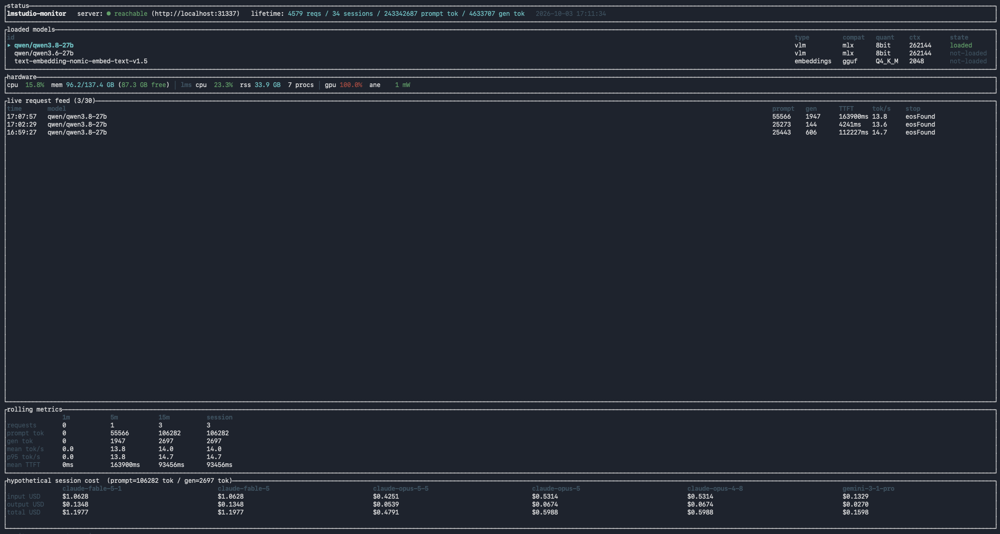

# LMS-Monitor

A terminal dashboard for [LM Studio](https://lmstudio.ai) on macOS. It watches your local inference as it happens (every request's tokens, time to first token and throughput), shows what the same tokens would have cost on frontier APIs, and keeps live Apple Silicon hardware telemetry alongside.



It's passive: it reads LM Studio's own stats stream and never sits in the request path, so nothing about how you call LM Studio changes.

## Features

- **Live request feed**: the last 30 requests, newest first, with start time, model, prompt and generated tokens, time to first token, tokens per second and stop reason. Context overflow shows in red: the stop reason `contextLengthReached` when generation ran into the context limit, and a whole `rejected (ctx N)` row when LM Studio refused a request because its prompt didn't fit the loaded context. The feed shows as many rows as fit (4 in a 36-row terminal, 8 in a 40-row one) and doesn't scroll.
- **Models**: your downloaded models, loaded or not, with type, format, quantization, maximum context length and load state; `▸` marks the model the last request went to. The panel has room for three, so extra models are cut off.
- **Rolling metrics**: requests, prompt and generated tokens, mean and p95 tokens per second, and mean time to first token over the last 1, 5 and 15 minutes and the whole session.
- **Hypothetical cost**: the session's prompt and generated tokens priced at list rates for Claude Fable 5.1, Fable 5, Opus 5.5, Opus 5, Opus 4.8 and Gemini 3.1 Pro.
- **Hardware**: system CPU and memory; CPU, memory and process count summed over LM Studio's processes (the app, its helpers, the inference worker and the `lms` CLI); GPU active residency and Neural Engine power. LM Studio's CPU is per core, so it can pass 100%.
- **History**: lifetime request, session and token totals, kept in a local SQLite database along with each request's stop reason and every refused request. Each run of the monitor is one session.

## How it works

LM Studio publishes per-request events on its log stream. LMS-Monitor runs `lms log stream -s model --stats --json` as a subprocess and reads it line by line: each request produces one event when it starts and another, carrying its stats, when it finishes, and the monitor pairs the two. It also polls the server's `/api/v0/models` endpoint every 2 seconds for the model list. Hardware figures come from [`sysinfo`](https://crates.io/crates/sysinfo) and from macOS's `powermetrics`, which needs sudo.

A request whose prompt doesn't fit the model's loaded context never reaches that stream: LM Studio refuses it before anything runs. Its only trace is an error line in LM Studio's server log, so the monitor also follows the newest file under `~/.lmstudio/server-logs` and picks those lines out.

Only requests made while the monitor is running are counted; it doesn't read LM Studio's history.

**Privacy:** the stream carries each request's full prompt and response text, and the server log holds full request bodies. The monitor discards that text as it reads each line and never logs or stores it; the database holds only per-request metadata (model, token counts, timings, stop reason). Nothing leaves your machine: the only network traffic is to the LM Studio server, and the cost figures come from a pricing table compiled into the binary.

## Requirements

- macOS. Apple Silicon is recommended: the GPU and Neural Engine figures come from `powermetrics`.
- LM Studio with its local server running (Developer tab → Start Server). The `lms` CLI ships with LM Studio at `~/.lmstudio/bin/lms` and doesn't need to be on your `PATH`.
- A terminal at least 120 columns wide and 36 rows tall. The status line is longer (about 145 columns), so in a narrower window its clock is cut off.
- Rust 1.94 or newer, to build.
- sudo, for the GPU and Neural Engine figures only.

## Install

Clone the repository, then from its directory:

```sh
cargo build --release          # binary at target/release/lmstudio-monitor
cargo install --path .         # or: put lmstudio-monitor on your PATH via ~/.cargo/bin
```

## Usage

```sh
lmstudio-monitor
```

It connects to LM Studio's default address, `http://localhost:1234`. If your server listens elsewhere, pass `--base-url` or set `LMS_BASE_URL`.

Before the dashboard opens, it runs `sudo -v`, which asks for your password unless sudo has it cached. Sudo is used only to start `powermetrics` for the GPU and Neural Engine figures; if it fails, those two show `n/a` and everything else still works. Run the monitor as your normal user, not under `sudo`: a root run also runs `lms` as root and can leave root-owned files in your Application Support folder (see Troubleshooting).

`--no-tui` runs headless instead: one summary line per request on stderr, still recorded to the database, and no sudo prompt.

### Flags

| flag | default | purpose |
|---|---|---|
| `--base-url <URL>` | `http://localhost:1234` (env `LMS_BASE_URL`) | LM Studio server |
| `--lms-bin <PATH>` | `~/.lmstudio/bin/lms` (env `LMS_BIN`) | the `lms` CLI |
| `--server-log-dir <DIR>` | `~/.lmstudio/server-logs` (env `LMS_SERVER_LOG_DIR`) | LM Studio's server log, for refused requests |
| `--config <PATH>` | `~/Library/Application Support/lmstudio-monitor/config.toml` | optional config file |
| `--db <PATH>` | `~/Library/Application Support/lmstudio-monitor/usage.db` | SQLite database |
| `--no-tui` | off | headless mode |

### Keys

| key | action |
|---|---|
| `q` or `Ctrl-C` | quit |
| `r` | reset the session: clears the feed, rolling metrics and cost panel (the database and lifetime totals keep everything) |
| `p` | pause or resume. Requests that finish while paused are saved to the database and counted in the lifetime totals, but they never reach the feed, rolling metrics or cost panel, even after you resume. Requests refused while paused are saved too, and never reach the feed. Everything else keeps updating. |

## Capture accuracy

Token counts, time to first token and tokens per second are LM Studio's own figures for each request. Two things are inferred:

- **Start time.** A request's stats arrive in a separate event when it finishes. The monitor matches that event to the oldest pending start event for the same model that is recent enough to belong to it; if none is, it uses the finish time. With several requests in flight on one model, a request can get another one's start time.
- **Windows.** The 1, 5 and 15 minute windows count requests by start time, so a request that ran longer than a minute never shows in the 1m column.

A request shows up only once it finishes. Requests that finish while the `lms` stream is restarting, or whose stats event is missing a field the monitor needs, aren't recorded.

A refused request shows up within about a second, at the time LM Studio logged the refusal (to the second), so a refused row's time is when it was refused while a completed row's is when it started. Refused requests don't count in the rolling metrics, cost panel or lifetime totals, since nothing ran. They're recognized by the MLX engine's error, `Input does not fit in context length`; the llama.cpp engine's wording is matched from its message templates but hasn't been seen in a real log yet.

## Configuration

Prices live in [`pricing.toml`](pricing.toml) and are compiled in. To change any of them, add overrides to `~/Library/Application Support/lmstudio-monitor/config.toml`, or to a file you pass with `--config`. Each entry replaces one model's rates; the others keep their defaults. For example, if most of your prompts run past 200K tokens, price Gemini at its long-context rate:

```toml
[pricing.providers.google.models.gemini-3-1-pro]
input_per_mtok_usd  = 4.00
output_per_mtok_usd = 18.00
```

Entries must sit under `[pricing.providers.<provider>.models.<model>]`; anything else in the file is ignored. The cost panel always shows the same six models, so entries for other model names have no effect. A missing config file is fine, including a `--config` path that doesn't exist, but a file that doesn't parse stops the monitor at startup with the error.

The cost panel is a rough comparison, not a quote. It applies list prices to your local model's token counts (a frontier model would tokenize the same text differently), and it ignores prompt caching, batch discounts and long-context pricing tiers.

## Files

| file | location |
|---|---|
| database | `~/Library/Application Support/lmstudio-monitor/usage.db` |
| log | `~/Library/Application Support/lmstudio-monitor/lmstudio-monitor.log` |
| config (optional) | `~/Library/Application Support/lmstudio-monitor/config.toml` |

The log isn't rotated. `LMS_LOG` sets its filter: `LMS_LOG=debug` adds detail, and `LMS_LOG=info,lmstudio_monitor::powermetrics=trace` adds the raw `powermetrics` output. A bare `LMS_LOG=trace` also turns on trace output from every library the monitor uses.

## Troubleshooting

| symptom | check |
|---|---|
| header shows `server: ● unreachable` | Is the LM Studio server running (`~/.lmstudio/bin/lms server status`)? Is `--base-url` pointing at its port? The `err:` text after the status says what failed. The models panel keeps showing the last list it got. |
| no requests appear | Does the header show `[PAUSED]`? Requests appear only when they finish. `~/.lmstudio/bin/lms log stream -s model --stats --json` should print a JSON line when a request starts and another when it finishes; if it doesn't, update LM Studio. If `lms` lives elsewhere, pass `--lms-bin`; when it can't be started, the log shows `lms log stream error`. |
| refused requests never appear | Is `--server-log-dir` pointing at LM Studio's server log folder, the one with `YYYY-MM` subfolders? If the monitor can't read it, the log says `server log folder … context-overflow rejections won't show`. When the monitor sees a refusal, the log says `context overflow:`. |
| "Permission denied" on the log or database at startup | An earlier run under `sudo` left root-owned files: `sudo chown -R "$USER":staff ~/Library/Application\ Support/lmstudio-monitor`. |
| GPU or ANE shows `n/a` | Check that `sudo powermetrics --samplers cpu_power,gpu_power,ane_power -n 1` prints `GPU HW active residency` and `ANE Power` lines. Then run with `LMS_LOG=info,lmstudio_monitor::powermetrics=trace` and search the log for `powermetrics`. If they switch to `n/a` mid-run, powermetrics exited (the log says `powermetrics exited`); restart the monitor to bring them back. |

## Development

```sh
cargo test
cargo fmt --all --check && cargo clippy --all-targets --locked -- -D warnings
```

CI ([`.gitlab-ci.yml`](.gitlab-ci.yml)) runs the same checks, with `cargo test --locked`, on Linux; the tests need no LM Studio, sudo or terminal. [ARCHITECTURE.md](ARCHITECTURE.md) covers the module layout, data flow and design decisions.

[Ollama-Monitor](https://github.com/Ward-Software-Defined-Systems/Ollama-Monitor) is a sibling project that shows the same dashboard for Ollama.

## License

MIT, see [LICENSE](LICENSE).

LMS-Monitor is an independent project, not affiliated with or endorsed by LM Studio, Anthropic or Google.
